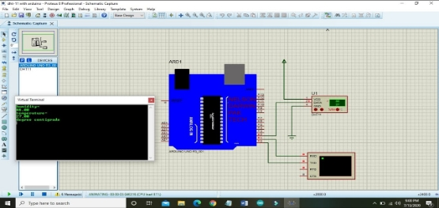

**DHT 11 với LCD** 

**I.Đấu nối** 

**Code DHT** 

#include <DHT.h>

#include <Wire.h> 

#include <LiquidCrystal\_I2C.h>

LiquidCrystal\_I2C lcd(0x3F,16,2);

const int DHTPIN = 4;

const int DHTTYPE = DHT11;

DHT dht(DHTPIN, DHTTYPE);

byte degree[8] = {

`  `0B01110,

`  `0B01010,

`  `0B01110,

`  `0B00000,

`  `0B00000,

`  `0B00000,

`  `0B00000,

`  `0B00000

};

void setup() {

`  `lcd.init();  

`  `lcd.backlight();

`  `lcd.print("Nhiet do: ");

`  `lcd.setCursor(0,1);

`  `lcd.print("Do am: ");

`  `lcd.createChar(1, degree);

`  `dht.begin();  

}

void loop() {

`  `float h = dht.readHumidity();

`  `float t = dht.readTemperature();

`  `if (isnan(t) || isnan(h)) {

`  `} 

`  `else {

`    `lcd.setCursor(10,0);

`    `lcd.print(round(t));

`    `lcd.print(" ");

`    `lcd.write(1);

`    `lcd.print("C");

`    `lcd.setCursor(10,1);

`    `lcd.print(round(h));

`    `lcd.print(" %");    

`  `}

}

***RTC thiết bị thời gian thật*** 

#include <Wire.h>

#include <LiquidCrystal\_I2C.h>

#include "RTClib.h"

RTC\_DS1307 rtc;

char daysOfTheWeek[7][12] = {"Sun", "Mon", "Tue", "Wed", "Thu", "Fri", "Sat"};

**void** setup ()

{

Serial.begin(9600);

**if** (! rtc.begin())

{

Serial.print("Couldn't find RTC");

**while** (1);

}

**if** (! rtc.isrunning())

{

Serial.print("RTC is NOT running!");

Serial.println();

}

rtc.adjust(DateTime(F(\_\_DATE\_\_), F(\_\_TIME\_\_)));

//rtc.adjust(DateTime(2014, 1, 21, 3, 0, 0));

}

**void** loop ()

{

DateTime now = rtc.now();

**if**(now.hour()<=9)

{

Serial.print("0");

Serial.print(now.hour());

}

**else** {

Serial.print(now.hour());

}

Serial.print(':');

**if**(now.minute()<=9)

{

Serial.print("0");

Serial.print(now.minute());

}

**else** {

Serial.print(now.minute());

}

Serial.print(':');

**if**(now.second()<=9)

{

Serial.print("0");

Serial.print(now.second());

}

**else** {

Serial.print(now.second());

}

Serial.println();

Serial.print(daysOfTheWeek[now.dayOfTheWeek()]);

Serial.print(",");

**if**(now.day()<=9)

{

Serial.print("0");

Serial.print(now.day());

}

**else** {

Serial.print(now.day());

}

Serial.print('/');

**if**(now.month()<=9)

{

Serial.print("0");

Serial.print(now.month());

}

**else** {

Serial.print(now.month());

}

Serial.print('/');

**if**(now.year()<=9)

{

Serial.print("0");

Serial.print(now.year());

}

**else** {

Serial.print(now.year());

} 

Serial.println();

delay(1000);

}

**rain** 

`  `#include<Wire.h>

`  `#include<LiquidCrystal\_I2C.h>

`  `LiquidCrystal\_I2C lcd(0x27,16,2);

`  `int led = 3;

`  `int led\_Rain = 11;

`  `void setup() {

`    `pinMode(4, OUTPUT);

`    `pinMode(5, OUTPUT);

`    `pinMode(6, OUTPUT);

`    `pinMode(7, OUTPUT);

`    `lcd.init();

`    `lcd.backlight();

`    `pinMode(led, OUTPUT);

`    `pinMode(led\_Rain, OUTPUT);

`    `lcd.setCursor(2, 0);

`    `lcd.print("SENSOR LIGHT");

`    `delay(1000);

`    `lcd.clear();

`  `}

`  `void loop() {

`    `digitalWrite(4, 1);

`    `digitalWrite(5, 0);

`    `digitalWrite(6, 1);

`    `digitalWrite(7, 0);

`    `delay(3000);

`    `digitalWrite(4, 0);

`    `digitalWrite(5, 0);

`    `digitalWrite(6, 0);

`    `digitalWrite(7, 0);

`    `delay(500);

`    `digitalWrite(4, 0);

`    `digitalWrite(5, 1);

`    `digitalWrite(6, 0);

`    `digitalWrite(7, 1);

`    `delay(3000);

`    `//Cảm biến ánh sáng

`    `int gtri\_Analog = analogRead(A0);

`    `lcd.setCursor(0, 0);

`    `lcd.print("GIA TRI ANALOG");

`    `lcd.clear();

`    `if (gtri\_Analog < 500)

`    `{

`      `digitalWrite(led, HIGH);

`      `lcd.setCursor(2, 0);

`      `lcd.print("BrightLights");

`    `}

`    `else

`    `{

`      `digitalWrite(led, LOW);

`      `lcd.setCursor(2, 0);

`      `lcd.print("lightsOut");

`    `}

`    `delay(5000);

`    `lcd.clear();

`     `// Cảm biến mưa

`  `int rainSensorValue = analogRead(A1); 

`  `lcd.clear();

`  `lcd.setCursor(0, 0);

`  `lcd.print("RAIN SENSOR");

`  `if (rainSensorValue == 1) {

`    `digitalWrite(led, LOW);

`    `//lcd.setCursor(0, 1);

`    `Serial.print("No Rain");

`  `} else {

`    `digitalWrite(led, HIGH);

`    `//lcd.setCursor(0, 1);

`    `Serial.print("Rain Detected"); 

`  `}  

`  `delay(5000);

`  `//lcd.clear();

}

**l298**

// Motor A connectionsint enA = 9;int in1 = 8;int in2 = 7;// Motor B connectionsint enB = 3;int in3 = 5;int in4 = 4;

void setup() {

`	`// Set all the motor control pins to outputs

`	`pinMode(enA, OUTPUT);

`	`pinMode(enB, OUTPUT);

`	`pinMode(in1, OUTPUT);

`	`pinMode(in2, OUTPUT);

`	`pinMode(in3, OUTPUT);

`	`pinMode(in4, OUTPUT);

`	`// Turn off motors - Initial state

`	`digitalWrite(in1, LOW);

`	`digitalWrite(in2, LOW);

`	`digitalWrite(in3, LOW);

`	`digitalWrite(in4, LOW);

}

void loop() {

`	`directionControl();

`	`delay(1000);

`	`speedControl();

`	`delay(1000);

}

// This function lets you control spinning direction of motorsvoid directionControl() {

`	`// Set motors to maximum speed

`	`// For PWM maximum possible values are 0 to 255

`	`analogWrite(enA, 255);

`	`analogWrite(enB, 255);

`	`// Turn on motor A & B

`	`digitalWrite(in1, HIGH);

`	`digitalWrite(in2, LOW);

`	`digitalWrite(in3, HIGH);

`	`digitalWrite(in4, LOW);

`	`delay(2000);

`	`// Now change motor directions

`	`digitalWrite(in1, LOW);

`	`digitalWrite(in2, HIGH);

`	`digitalWrite(in3, LOW);

`	`digitalWrite(in4, HIGH);

`	`delay(2000);

`	`// Turn off motors

`	`digitalWrite(in1, LOW);

`	`digitalWrite(in2, LOW);

`	`digitalWrite(in3, LOW);

`	`digitalWrite(in4, LOW);

}

// This function lets you control speed of the motorsvoid speedControl() {

`	`// Turn on motors

`	`digitalWrite(in1, LOW);

`	`digitalWrite(in2, HIGH);

`	`digitalWrite(in3, LOW);

`	`digitalWrite(in4, HIGH);

`	`// Accelerate from zero to maximum speed

`	`for (int i = 0; i < 256; i++) {

`		`analogWrite(enA, i);

`		`analogWrite(enB, i);

`		`delay(20);

`	`}

`	`// Decelerate from maximum speed to zero

`	`for (int i = 255; i >= 0; --i) {

`		`analogWrite(enA, i);

`		`analogWrite(enB, i);

`		`delay(20);

`	`}

`	`// Now turn off motors

`	`digitalWrite(in1, LOW);

`	`digitalWrite(in2, LOW);

`	`digitalWrite(in3, LOW);

`	`digitalWrite(in4, LOW);

}

8

#define pinLedB 13
#define pinBtn 8

unsigned long thoiDiemNhan = 0;
unsigned long thoiDiemTha = 0;
unsigned long thoiDiemBatDau = 0;

void setup() {
  pinMode(pinLedB, OUTPUT);
  pinMode(pinBtn, INPUT);

  digitalWrite(pinLedB, LOW);
}

void loop() {
  unsigned long thoiGianHienTai = millis();

  if(digitalRead(pinBtn) == HIGH){
    thoiDiemNhan = thoiGianHienTai;
  } else {
    if(thoiDiemNhan != 0 && thoiDiemTha == 0){
      thoiDiemTha = thoiGianHienTai;
    }
  }

  if(thoiDiemTha - thoiDiemNhan > 2000){
    thoiDiemBatDau = thoiDiemTha;
    thoiDiemNhan = 0;
    thoiDiemTha = 0;
  }

  if(thoiDiemBatDau != 0 && thoiGianHienTai - thoiDiemBatDau < 2000){
    digitalWrite(pinLedB, HIGH);
  } else {
    digitalWrite(pinLedB, LOW);
  }
}
